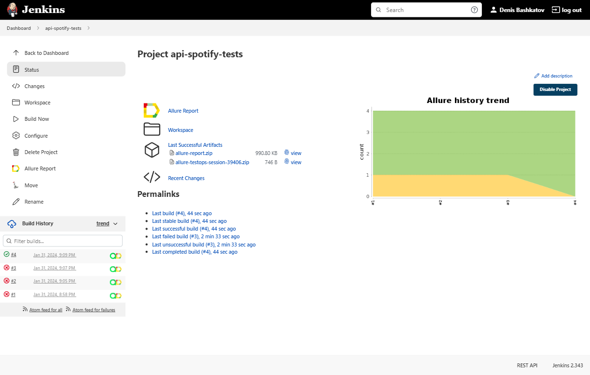
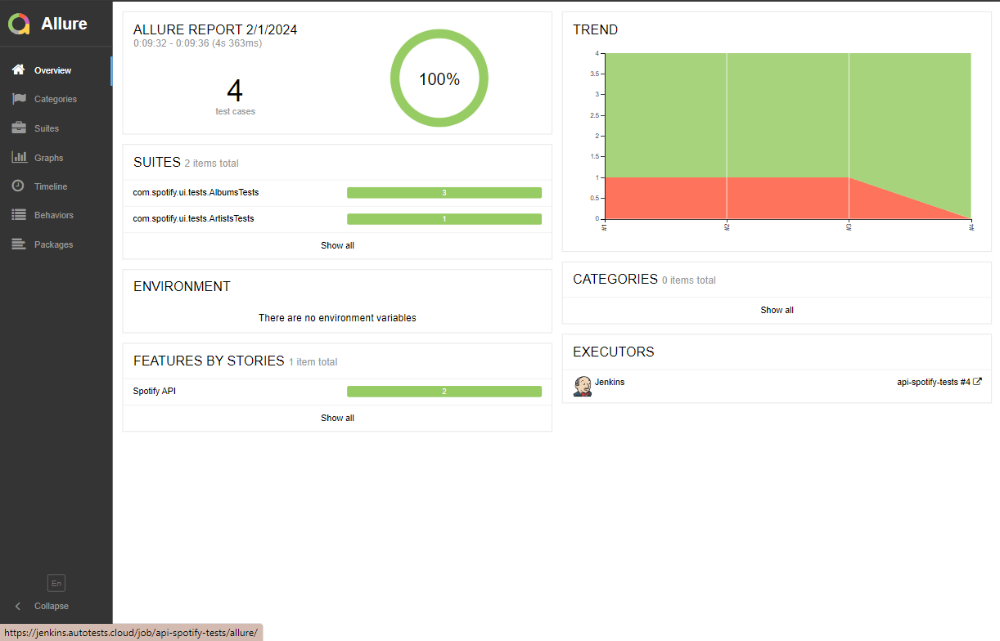
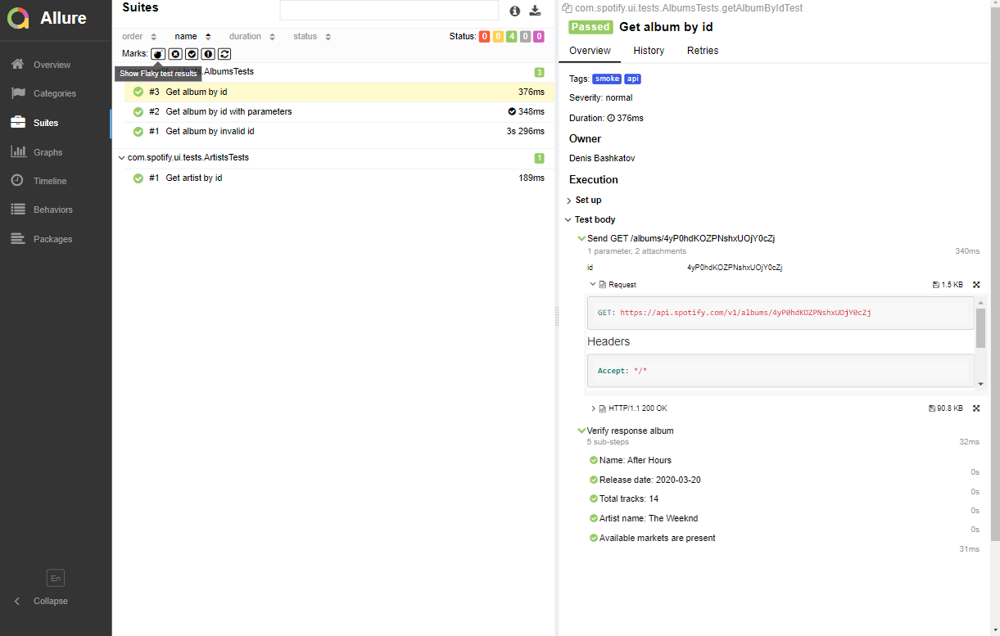
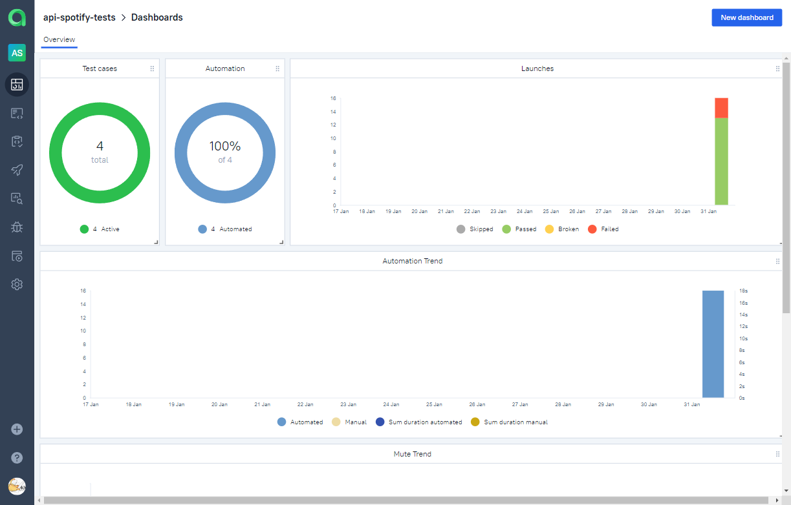
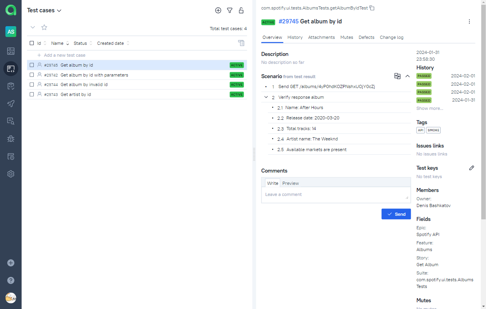
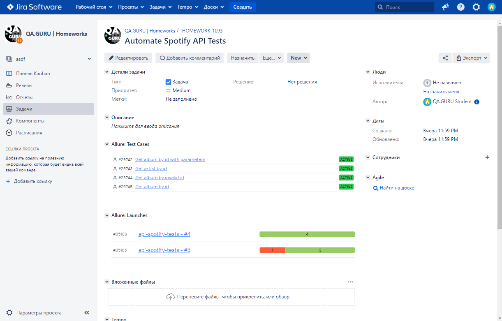
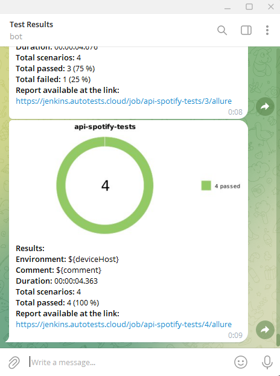

# Test automation project for [Spotify](https://open.spotify.com) API

<p align="center"><a href="https://open.spotify.com/"></a></p>  

## :bookmark_tabs: Contents
- [Technologies and tools](#computer-technologies-and-tools)
- [Features](#star2-features)
- [Test cases](#clipboard-test-cases)
- [Running tests locally](#rocket-running-tests-locally)
- [Build in Jenkins](#-build-in-jenkins)
- [Test results in Allure report](#-test-results-in-allure-report)
- [Test management in Allure TestOps](#-allure-testops)
- [Integration with Jira](#-integration-with-jira)
- [Remote launch in Browserstack](#-remote-launch-in-browserstack)
- [Notification of test results in Telegram](#-notification-of-test-results-in-telegram)

## :computer: Technologies and tools
<p align="center">
<a href="https://www.jetbrains.com/idea/"></a>
<a href="https://www.java.com/"></a>
<a href="https://github.com/allure-framework"></a>
<a href="https://qameta.io/"></a>
<a href="https://gradle.org/"></a>
<a href="https://junit.org/junit5/"></a>
<a href="https://rest-assured.io//"></a>
<a href="https://aerokube.com/selenoid/"></a>
<a href="https://github.com/"></a>
<a href="https://www.jenkins.io/"></a>
<a href="https://web.telegram.org/"></a>
<a href="https://www.atlassian.com/software/jira/"></a>
</p>

Automated tests are written in the `Java` language using `JUnit 5` and `Rest Assured`. The project is built with `Gradle`.
For remote execution, a task is implemented in `Jenkins` to generate an `Allure report` and send the results to `Telegram` using a bot.
Remote execution is carried out in `Selenoid`.
To manage test scenarios and manually initiate test runs, `Allure TestOps` is utilized, and the results of their completion are linked to `Jira` issues.

## :star2: Features
- `Object Serialization/Deserialization`: Utilizes `Jackson` to seamlessly transform data for handling API requests and responses
- `Request Specification`: Streamlines and centralizes API test configuration through the use of request specifications
- `Test data generation`: Utilizes the `Faker` library for generating random test data
- `JSON fixtures`: Efficient and organized data handling in the application through data mapping
- `Custom Allure Listener`: Provides informative logging of API requests and responses
- `Parallel Execution`: Speeds up tests, providing faster feedback and reduced time
- `Allure TestOps integration`: Unifies test reporting, analytics and launch management
- `Jira Integration`: Streamlines issue tracking, collaboration, and integrates Allure for test case and launch management
- `Autotests as Documentation`: Provides real-time insight into project functionality

## :clipboard: Test cases

- :white_check_mark: Get album by id
- :white_check_mark: Get album by invalid id
- :white_check_mark: Get album by id with parameters
- :white_check_mark: Get artist by id

## :rocket: Running tests locally

```bash
gradle clean test
```

##  Build in [Jenkins](https://jenkins.autotests.cloud/job/api-spotify-tests/)
<p align="center">  
</a>  
</p>

##  Test results in [Allure report](https://jenkins.autotests.cloud/job/api-spotify-tests/allure/)
<p align="center">  
</a>  
</p>
<p align="center">  
</a>  
</p>

##  Test management in [Allure TestOps](https://allure.autotests.cloud/project/4012/dashboards)
<p align="center">  
</a>  
</p>
<p align="center">  
</a>  
</p>

##  Integration with [Jira](https://jira.autotests.cloud/browse/HOMEWORK-1093)
<p align="center">  
</a>  
</p>


##  Notification of test results in [Telegram](https://play.google.com/store/apps/details?id=org.telegram.messenger&hl=ru&gl=US)
<p align="center">  
</a>  
</p>
